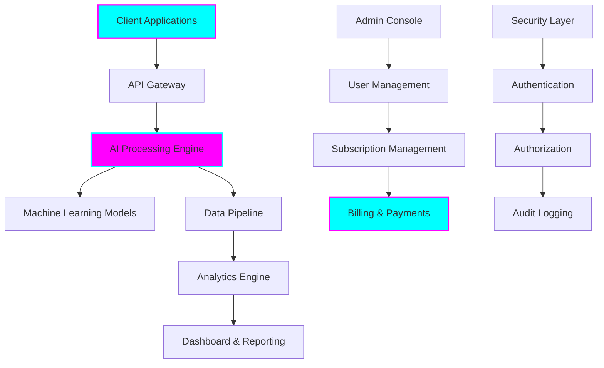

# Tiation AI Platform - SaaS Enterprise Solution

## 🚀 Executive Summary

**Tiation AI Platform** is a revolutionary Software-as-a-Service (SaaS) solution that transforms how enterprises deploy, manage, and scale artificial intelligence capabilities. Our platform reduces AI implementation time by 75% while providing enterprise-grade security, scalability, and compliance.

### Key Value Propositions

- **🎯 Rapid ROI**: Average payback period of 6-8 months
- **⚡ Fast Deployment**: Production-ready in 4-6 weeks
- **🔒 Enterprise Security**: SOC 2, GDPR, and HIPAA compliant
- **📈 Scalable Architecture**: Handle 500M+ API calls monthly
- **🤖 AI-First Design**: Pre-trained models and custom ML capabilities

---

## 💼 SaaS Platform Overview

### Platform Architecture



### Core SaaS Features

#### 1. Multi-Tenant Architecture
- **Secure Isolation**: Each tenant has dedicated resources and data isolation
- **Shared Infrastructure**: Cost-effective scaling across multiple customers
- **Custom Branding**: White-label options for enterprise customers
- **Resource Allocation**: Dynamic scaling based on subscription tier

#### 2. Subscription Management
- **Flexible Pricing**: Usage-based, seat-based, and feature-based models
- **Self-Service Portal**: Customers can upgrade/downgrade independently
- **Automated Billing**: Integration with Stripe, PayPal, and enterprise systems
- **Usage Analytics**: Real-time monitoring and reporting

#### 3. API-First Design
- **RESTful APIs**: Comprehensive API suite for all platform features
- **GraphQL Support**: Flexible data querying capabilities
- **Webhooks**: Real-time event notifications
- **SDK Libraries**: Support for Python, JavaScript, Java, Go, and more

---

## 📊 Pricing & Subscription Plans

### Starter Plan - $299/month
**Perfect for small businesses and startups**

- ✅ **10 AI Models** (pre-trained)
- ✅ **100,000 API calls** per month
- ✅ **Basic analytics** dashboard
- ✅ **Email support** (48-hour response)
- ✅ **Standard integrations** (20+ platforms)
- ✅ **SSL encryption** and basic security
- ✅ **Community access** and documentation

**Target Audience**: Small businesses, startups, developers
**Use Cases**: Chatbots, content generation, basic automation

### Professional Plan - $799/month
**Ideal for growing businesses and teams**

- ✅ **50 AI Models** (pre-trained + custom)
- ✅ **1M API calls** per month
- ✅ **Advanced analytics** with custom dashboards
- ✅ **Priority support** (24-hour response)
- ✅ **Premium integrations** (100+ platforms)
- ✅ **Custom workflows** and automation
- ✅ **SSO integration** (SAML, OAuth)
- ✅ **Team collaboration** tools
- ✅ **API rate limiting** controls

**Target Audience**: Growing businesses, development teams
**Use Cases**: Advanced automation, multi-channel deployment, team workflows

### Enterprise Plan - $2,499/month
**Built for large enterprises and mission-critical applications**

- ✅ **Unlimited AI Models** (including custom training)
- ✅ **10M+ API calls** per month
- ✅ **Real-time analytics** and business intelligence
- ✅ **24/7 dedicated support** with SLA
- ✅ **All integrations** (150+ platforms)
- ✅ **Custom AI model training** and deployment
- ✅ **White-label options** with custom branding
- ✅ **Dedicated infrastructure** and VPC
- ✅ **Advanced security** features
- ✅ **Compliance certifications** (SOC 2, HIPAA)
- ✅ **Custom contracts** and SLAs

**Target Audience**: Large enterprises, government, healthcare
**Use Cases**: Mission-critical applications, high-scale deployments, regulatory compliance

---

## 🔧 Technical Specifications

### Infrastructure & Scaling

#### Cloud Architecture
- **Multi-Cloud Deployment**: AWS, Azure, Google Cloud Platform
- **Global CDN**: Low-latency access worldwide
- **Auto-Scaling**: Dynamic resource allocation
- **High Availability**: 99.9% uptime SLA

#### Performance Metrics
- **Response Time**: <100ms for standard API calls
- **Throughput**: 10,000+ requests per second
- **Scalability**: Handle 500M+ API calls monthly
- **Storage**: Unlimited data retention options

#### Security & Compliance
- **Encryption**: End-to-end encryption (AES-256)
- **Authentication**: Multi-factor authentication (MFA)
- **Authorization**: Role-based access control (RBAC)
- **Compliance**: SOC 2, GDPR, HIPAA, ISO 27001

### AI & Machine Learning Capabilities

#### Pre-trained Models
- **Natural Language Processing**: Text analysis, sentiment, summarization
- **Computer Vision**: Image recognition, object detection, OCR
- **Speech & Audio**: Speech-to-text, voice synthesis, audio analysis
- **Predictive Analytics**: Forecasting, anomaly detection, pattern recognition

#### Custom Model Training
- **AutoML**: Automated machine learning pipeline
- **Custom Training**: Bring your own data and models
- **Model Versioning**: Track and manage model iterations
- **A/B Testing**: Compare model performance

---

## 🛠️ Implementation & Integration

### Quick Start Guide

#### 1. Account Setup (5 minutes)
```bash
# Sign up for free trial
curl -X POST https://api.tiation.ai/v1/auth/signup \
  -H "Content-Type: application/json" \
  -d '{
    "email": "your@email.com",
    "company": "Your Company",
    "plan": "starter"
  }'
```

#### 2. API Key Generation
```bash
# Generate API key
curl -X POST https://api.tiation.ai/v1/auth/keys \
  -H "Authorization: Bearer YOUR_TOKEN" \
  -d '{"name": "production-key"}'
```

#### 3. First API Call
```python
import requests

# Initialize the API client
api_key = "your-api-key-here"
headers = {"Authorization": f"Bearer {api_key}"}

# Make your first AI request
response = requests.post(
    "https://api.tiation.ai/v1/ai/analyze",
    headers=headers,
    json={
        "text": "Analyze this customer feedback: Great product!",
        "model": "sentiment-analysis"
    }
)

result = response.json()
print(f"Sentiment: {result['sentiment']}")
print(f"Confidence: {result['confidence']}")
```

### Enterprise Integration

#### Single Sign-On (SSO)
```yaml
# SAML Configuration
saml_config:
  entity_id: "https://your-company.com/saml"
  sso_url: "https://your-company.com/sso"
  certificate: "-----BEGIN CERTIFICATE-----..."
  attributes:
    email: "http://schemas.xmlsoap.org/ws/2005/05/identity/claims/emailaddress"
    name: "http://schemas.xmlsoap.org/ws/2005/05/identity/claims/name"
```

#### Webhook Configuration
```javascript
// Configure webhooks for real-time notifications
const webhook = {
  url: "https://your-app.com/webhooks/tiation",
  events: [
    "model.trained",
    "usage.limit.reached",
    "billing.invoice.created"
  ],
  secret: "your-webhook-secret"
};
```

---

## 📈 Business Intelligence & Analytics

### Usage Analytics Dashboard

#### Real-Time Metrics
- **API Call Volume**: Track usage patterns and trends
- **Model Performance**: Monitor accuracy and response times
- **Cost Analysis**: Understand spending patterns and optimization opportunities
- **User Activity**: Track team usage and collaboration

#### Custom Reports
- **Usage Reports**: Detailed breakdowns by user, model, and time period
- **Performance Reports**: Model accuracy, latency, and error rates
- **Cost Reports**: Detailed billing and usage cost analysis
- **Compliance Reports**: Audit trails and security event logs

### ROI Calculation Tools

#### Cost Savings Analysis
```python
# Calculate ROI from AI implementation
def calculate_roi(monthly_savings, implementation_cost, monthly_platform_cost):
    annual_savings = monthly_savings * 12
    annual_cost = monthly_platform_cost * 12
    net_savings = annual_savings - annual_cost
    roi_percentage = (net_savings / implementation_cost) * 100
    payback_months = implementation_cost / (monthly_savings - monthly_platform_cost)
    
    return {
        "annual_savings": annual_savings,
        "annual_cost": annual_cost,
        "net_savings": net_savings,
        "roi_percentage": roi_percentage,
        "payback_months": payback_months
    }

# Example calculation
roi = calculate_roi(
    monthly_savings=15000,    # $15K saved per month
    implementation_cost=50000, # $50K implementation cost
    monthly_platform_cost=2499 # Enterprise plan cost
)
```

---

## 🔒 Security & Compliance

### Security Framework

#### Data Protection
- **Encryption at Rest**: AES-256 encryption for stored data
- **Encryption in Transit**: TLS 1.3 for all communications
- **Key Management**: Hardware security modules (HSMs)
- **Data Residency**: Choose your data storage location

#### Access Control
- **Zero Trust Architecture**: Never trust, always verify
- **Multi-Factor Authentication**: Required for all accounts
- **Role-Based Access**: Granular permission management
- **Session Management**: Automatic timeout and monitoring

### Compliance Certifications

#### SOC 2 Type II
- **Security**: Comprehensive security controls
- **Availability**: 99.9% uptime guarantee
- **Processing Integrity**: Data accuracy and completeness
- **Confidentiality**: Information protection protocols

#### GDPR Compliance
- **Data Minimization**: Collect only necessary data
- **Right to Erasure**: Delete data upon request
- **Data Portability**: Export data in standard formats
- **Privacy by Design**: Built-in privacy protection

#### HIPAA Compliance
- **Business Associate Agreement**: Available for healthcare customers
- **Administrative Safeguards**: Workforce training and access management
- **Physical Safeguards**: Secure data centers and equipment
- **Technical Safeguards**: Access controls and audit logs

---

## 🎯 Use Cases & Success Stories

### Customer Success Stories

#### TechCorp Inc. - 300% ROI in 8 Months
**Challenge**: Manual customer support consuming 40% of staff time
**Solution**: Implemented AI-powered chatbot and sentiment analysis
**Results**: 
- 75% reduction in support tickets
- $180K annual savings
- 300% ROI within 8 months

#### MedDevice Co. - Compliance Automation
**Challenge**: Manual regulatory compliance reporting
**Solution**: Custom AI models for document analysis and reporting
**Results**:
- 90% reduction in compliance processing time
- 100% accuracy in regulatory reporting
- $500K annual cost savings

#### RetailChain Ltd. - Predictive Analytics
**Challenge**: Inventory management and demand forecasting
**Solution**: Custom ML models for sales prediction
**Results**:
- 35% reduction in inventory costs
- 98% forecast accuracy
- $2M annual savings

### Industry Applications

#### Healthcare
- **Medical Imaging**: Automated diagnosis and analysis
- **Drug Discovery**: Accelerated research and development
- **Patient Care**: Personalized treatment recommendations
- **Compliance**: Automated regulatory reporting

#### Financial Services
- **Fraud Detection**: Real-time transaction monitoring
- **Risk Assessment**: Credit scoring and loan decisions
- **Algorithmic Trading**: Automated investment strategies
- **Regulatory Compliance**: Anti-money laundering (AML)

#### Manufacturing
- **Predictive Maintenance**: Equipment failure prediction
- **Quality Control**: Automated defect detection
- **Supply Chain**: Demand forecasting and optimization
- **Process Optimization**: Efficiency improvements

---

## 🚀 Roadmap & Future Features

### Q1 2025 Releases

#### Advanced AI Capabilities
- **Multi-Modal AI**: Combined text, image, and audio processing
- **Federated Learning**: Collaborative model training
- **Edge AI**: Local processing for low-latency applications
- **Quantum-Ready**: Preparation for quantum computing

#### Platform Enhancements
- **No-Code Interface**: Visual workflow builder
- **Advanced Monitoring**: Real-time performance insights
- **Cost Optimization**: Automated resource management
- **Global Expansion**: New data centers worldwide

### Q2 2025 Releases

#### Enterprise Features
- **Custom Deployments**: On-premises and hybrid options
- **Advanced Analytics**: Predictive business intelligence
- **Industry Templates**: Pre-built solutions for specific sectors
- **Partner Ecosystem**: Third-party integrations and marketplace

---

## 📞 Support & Contact

### Customer Support

#### Support Channels
- **Email**: support@tiation.ai
- **Live Chat**: Available 24/7 for Enterprise customers
- **Phone**: +1-800-TIATION (Enterprise only)
- **Help Center**: https://help.tiation.ai

#### Support Levels
- **Starter**: Email support, 48-hour response
- **Professional**: Priority support, 24-hour response
- **Enterprise**: 24/7 dedicated support, 4-hour response SLA

### Sales & Partnerships

#### Sales Team
- **Email**: sales@tiation.ai
- **Phone**: +1-800-TIATION
- **Demo Requests**: https://tiation.ai/demo

#### Partnership Opportunities
- **Technology Partners**: Integration and reseller programs
- **Implementation Partners**: Certified consultants and integrators
- **Investment Partners**: Venture capital and strategic investors

### Professional Services

#### Implementation Services
- **Solution Architecture**: Custom platform design
- **Data Migration**: Seamless transition from existing systems
- **Training Programs**: Team onboarding and certification
- **Ongoing Support**: Maintenance and optimization

#### Consulting Services
- **AI Strategy**: Business transformation consulting
- **Use Case Development**: Custom solution design
- **Performance Optimization**: Platform tuning and scaling
- **Compliance Guidance**: Regulatory and security consulting

---

## 📚 Additional Resources

### Documentation
- **API Reference**: https://docs.tiation.ai/api
- **SDK Documentation**: https://docs.tiation.ai/sdks
- **Tutorials**: https://docs.tiation.ai/tutorials
- **Best Practices**: https://docs.tiation.ai/best-practices

### Community
- **Developer Forum**: https://community.tiation.ai
- **GitHub**: https://github.com/tiation/tiation-ai-platform
- **Blog**: https://blog.tiation.ai
- **Newsletter**: https://tiation.ai/newsletter

### Training & Certification
- **Tiation University**: https://university.tiation.ai
- **Certification Programs**: Developer, Administrator, Architect
- **Webinars**: Monthly training sessions
- **Workshops**: Hands-on learning experiences

---

*Built with ❤️ by the Tiation team. Transforming the future of enterprise AI.*
